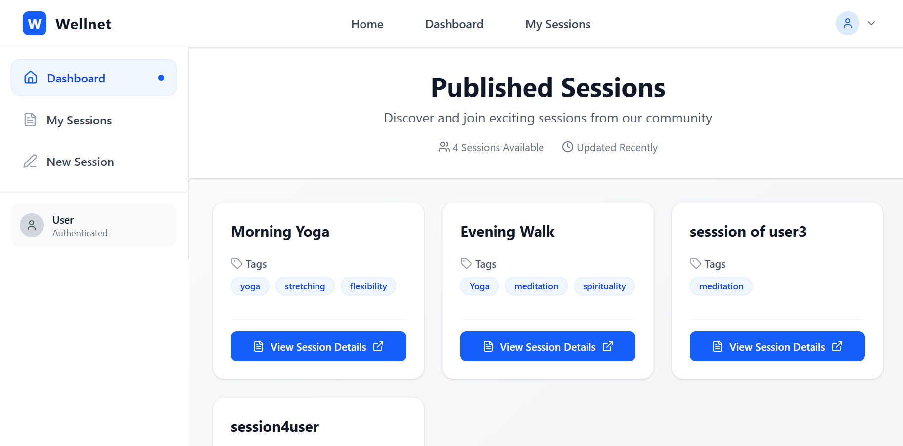
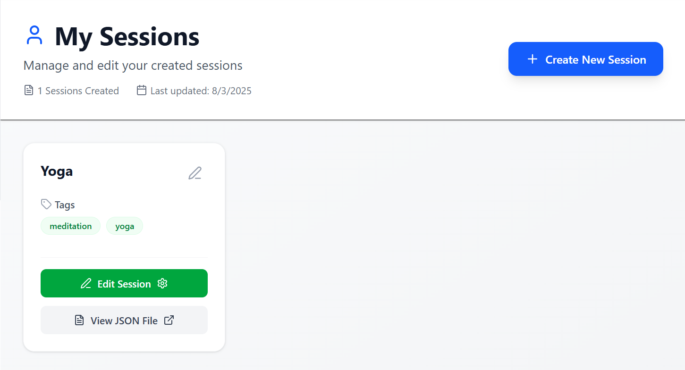
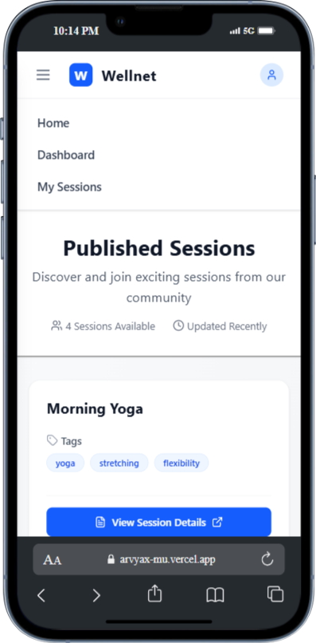
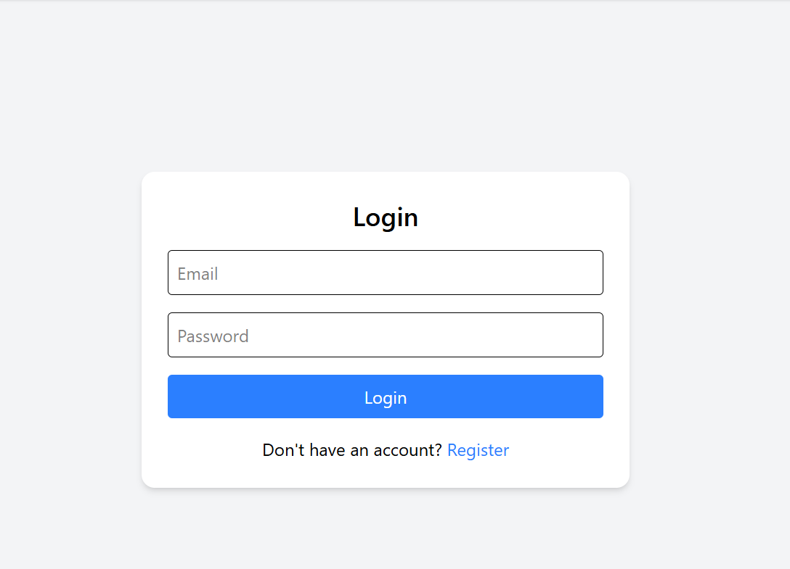

# WellNet-Arvyax
[Live Demo](https://arvyax-mu.vercel.app/)


**WellNet-Arvyax** is a wellness session management platform that enables users to schedule, write, and track wellness-related sessions with autosave capabilities and a user-friendly dashboard. Built with a modular fullstack architecture, it provides a seamless and secure experience from authentication to session tracking and management.

The project uses a **React + TailwindCSS** frontend with a **Node.js + Express** backend and **MongoDB** as the database.

---

##  Tech Stack

###  Frontend
- **React (Vite)** – Modern UI powered by a fast build system.
- **Tailwind CSS** – Utility-first styling for responsive design.
- **React Router** – Client-side routing for smooth navigation.
- **lucide-react** – Icon library for modern UI components.
- **Axios** – Simplified HTTP client for API requests.

###  Backend
- **Node.js + Express** – RESTful API for authentication and session management.
- **MongoDB + Mongoose** – NoSQL database for flexible and scalable data storage.
- **JWT + Bcrypt** – Secure user authentication and password hashing.
- **dotenv + CORS** – Environment management and secure cross-origin requests.

---

## Features


###  Session Dashboard
- Overview of all user sessions in a card or list view.
- Displays titles, timestamps, and autosave status.
- Built with a responsive layout and conditional rendering.


---

###  Session Editor
- Rich-text editor interface to document wellness sessions.
- Autosaves drafts periodically to prevent data loss.
- Supports creation, updating, and deletion of session entries.

---

###  Responsive UI
- Fully responsive across mobile, tablet, and desktop devices.
- Built with Tailwind CSS breakpoints and ShadCN adaptive components.
- Ensures seamless user experience across all screen sizes.



###  Authentication
- Secure signup and login flow using **JWT** tokens.
- Passwords hashed using **bcrypt** before storage.
- Authenticated routes protected using middleware.


---

###  Session Management APIs
- RESTful API endpoints for CRUD operations on session documents.
- Token-based access control for session privacy and security.
- Designed to be scalable with modular controller logic.

---


###  Secure Middleware
- Custom Express middleware for token verification.
- Error handling for unauthorized or malformed requests.
- Enables secure routing for all protected endpoints.

---

### Backend Highlights
- **Express API** handles all session and auth logic in a modular structure.
- **Mongoose models** define schemas for sessions and users.
- Middleware ensures all session routes are protected with JWTs.
- MongoDB schema designed for simplicity and extensibility.

### 🗂 Folder Structure
```
arvyax/
├── frontend/       
│   ├── public/            
│   ├── src/               
│   │   ├── components/    
│   │   ├── pages/         
│   │   ├── App.jsx        
│   │   ├── index.jsx      
│   │   └── styles.css     
│   ├── .env.local         
│   ├── package-lock.json  
│   └── package.json
├── backend/         
│   ├── controller/       
│   │   ├── sessionController.js
│   │   └── userController.js
│   ├── middleware/         
│   │   └── authMiddleware.js
│   ├── routes/            
│   │   ├── sessionRoutes.js
│   │   └── userRoutes.js
│   ├── db.js               
│   ├── index.js  
│   ├── .env   
│   ├── .gitignore   
│   ├── package-lock.json
│   └── package.json          
```
## API Endpoints 

### User Authentication

- **POST /api/v1/auth/register** - Register a new user.
- **POST /api/v1/auth/login** - Authenticate a user and return a JWT.

### Session Management
- **GET /api/v1/sessions** - Retrieve all the published sessions for all users.
- **GET /api/v1/my-sessions** - Retrieve all the sessions of the user for the authenticated user.
- **GET /api/v1/sessions/:id** - Get a specific session by ID.

- **POST /api/v1/my-sessions/save-draft** - Creates a new session and save the the session as draft.

- **POST /api/v1/my-sessions/publish** - Publishes a session which can be viewed by others.

- **PUT /api/v1/my-sessions/save-draft/:id** - Update a session by ID .


### Live Demo
You can try the live demo of the application at [Live Demo](https://arvyax-mu.vercel.app/).
